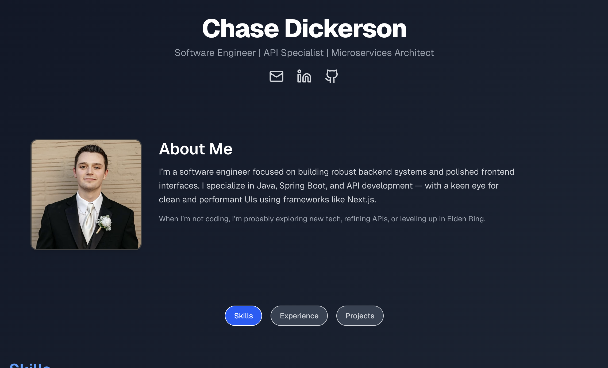
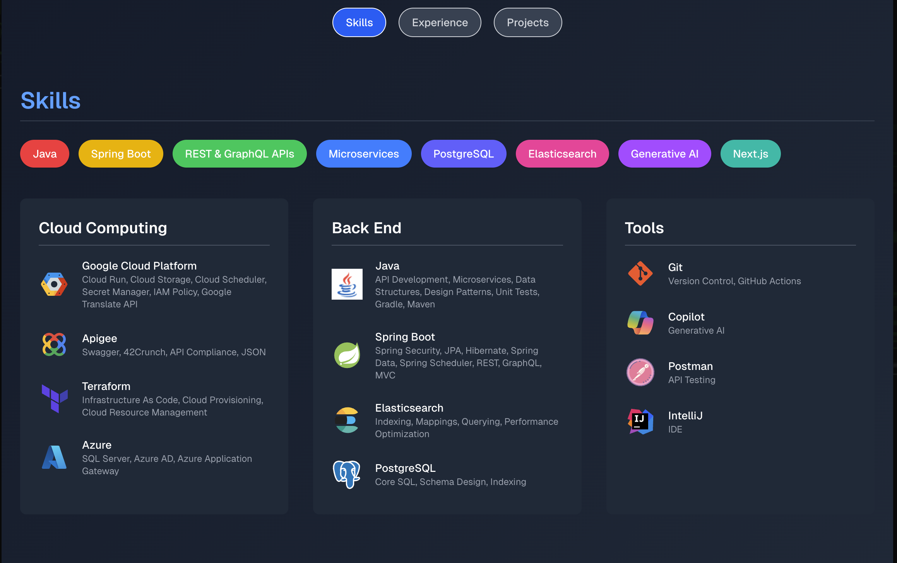
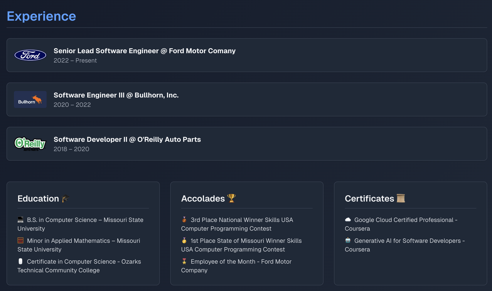

# 🚀 Developer Portfolio

A modern, responsive, and dynamic **developer portfolio** built with **Next.js** and **Tailwind CSS**.  
This portfolio showcases **About**, **Skills**, **Experience**, **Education**, **Accolades**, **Certificates**, and a **Tech Stack** section — all powered by clean, reusable, and data-driven components.

---

## 📸 Screenshots

### 🏠 Home Page

### 💡 Skills Section

### 📜 Experience & Achievements

---

## ✨ Features

- **Dynamic Sections**  
  Easily manage content like skills, experience, and achievements from a single constants file.
  
- **Responsive Design**  
  Fully optimized for mobile, tablet, and desktop devices.

- **Modern Styling**  
  Built with **Tailwind CSS** for rapid UI development and a professional, sleek look.

- **Tech Stack Showcase**  
  Displays your primary technologies with icons and colors for quick scanning.

- **Background Image Support**  
  Customizable background images with adjustable brightness.

- **Reusable Components**  
  Skills, Achievements, and Experience sections are all dynamically rendered from data arrays.

---

## 🛠️ Tech Stack

- **Framework:** [Next.js](https://nextjs.org/) (React-based)
- **Styling:** [Tailwind CSS](https://tailwindcss.com/)
- **Image Optimization:** Next.js `Image` component
- **Icons:** Emoji-based and custom SVG support
- **Version Control:** Git & GitHub

---

📝 License
This project is open-source and available under the MIT License.

👨‍💻 Author
Chase Dickerson

